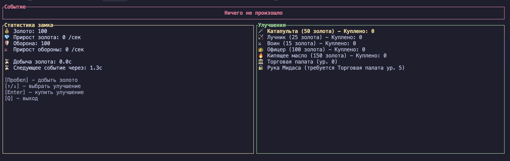

# Castle Clicker

Финальный проект для курса Otus "Rust Developer. Professional"

---

# О чем проект

Кликер и idle менеджер в терминале про развитие замка

- 📝 **TUI** - текстовый интерфейс в терминале
- 💎 **золото** - основная валюта, накапливается при клике на пробел
- 🛡️ **оборона** - очки защиты замка - игра заканичвается если они становятся равны 0
- 🔔 **события** - система которая генерирует события каждые 2.5 секунды
- 🛠️ **улучшения** - улучшения для замка, покупаются за золото. разово увеличивают оборону, либо повышают скорость генерации золота или обороны
- 🌐 **мультиязычность** - поддержка нескольких языков

---

# Технологии

- 🎨 **ratatui** - библиотека для создания TUI приложений
- 📢 **bevy_ecs** - библиотека для создания ECS систем
- 📖 **rust-i18n** - библиотека для работы с локализацией
- 📦 **serde** и **toml** - библиотеки для сериализации и десериализации TOML конфига

 

---
drawings:
  persist: false
class: text-center
---

# А теперь демо

